# Oque é Javascript?

JavaScript é uma linguagem de programação que potencializa o comportamento dinâmico na maioria dos sites, permitindo
implementar itens complexos em páginas web.

Está presente sempre que uma página da web faz mais do que simplesmente mostrar a você informação estática, mostrando
conteúdo que se atualiza em um intervalo de tempo, mapas interativos ou gráficos 2D/3D animados, etc.

Cria conteúdo que se atualiza dinamicamente, comoa múltimidias, imagens animadas, e tudo o mais que há de interessante.
OK, não tudo, mas é maravilhoso o que se pode efetuar com algumas linhas de Código JavaScript.

Junto com HTML e CSS, é uma tecnologia central que faz a web funcionar.

## CONSOLE

O console é um painel que exibe mensagens importantes para as pessoas desenvolvedoras.
Muito do trabalho que o computador faz com o código é invisivel para nós por padrão. Se
quisermos que as coisas apareçam em nossa tela podemos imprimir ou registrar diretamente
em nosso console.

Em JavaScript, a palavra-chave **console**, se refere a um objeto, uma coleção de dados
e ações, que podemos usar em nosso código.

Uma ação ou método embutido no objeto **console** é o método `.log()`. Ao escrever 
`console.log()`, o que estiver entre os parênteses será impresso ou registrado no console.

    `console.log('Boas-vindas a essa explicação');`
-----------------------------------------------------
Terminal:

    Boas-vindas a essa explicação
-----------------------------------------------------

O método console.log() é usado para registrar ou imprimir mensagens no console, mas também
pode ser usado para imprimir objetos e outras informações.

## COMENTÁRIOS

Seu próprio código pode tornar-se dificil de ser entendido quando você retornar a ele tempos
depois. Além disso, programar é uma atividae colaborativa, Por esses motivos, é útil deixar 
notas explicativas no código para nós mesmos ou outras pessoas desenvolvedoras.

Tais notas, ou comentários, existem apenas para leitores humanos e não são interpretados
pelo navegador.

Os comentários são boas práticas por vários motivos, como por exemplo, organizar as partes 
do código, explicar o funcionamento de blocos de código, dar dicas, deixar instruções ou
qualquer outra informação útil para outras pessoas, etc.

Em JavaScript, os **comentários de linha única** são criados com duas barras consecutivas //.

 `// Duas barras significam um comentário`

Já os comentários de várias linhas são criados circundando as linhas com /* no inicio e */
no final.

`/*
Use uma barra com asterisco no inicio e 
no final para comentários de várias linhas
*/

Também é possivel comentar algo no meio de uma linhas de código

    `console.log(/*Boas-vindas a*/ 'Explicação');`
---------------------------------------------------
Terminal:

    `Explicação`
------------------------------------------------------

## TIPOS DE DADOS

Os tipos de dados são as classificações dos diferentes tipos de dados usados na
programação. Em JavaScript, o mais recente padrão ECMAScript 6 define sete tipos de dados
fundamentais: **number, string, boolean, null, undefined, symbol e object.**

Seis tipos de dados são considerados tipos de dados primitivos e são os mais básicos da
linguagem:

 - Number(Número): Qualquer número, incluindo números
 com decimais: 4, 8, 1516, 23.42.

    `const quantidade = 24;
    let preco = 1.99;`

 - String: qualquer agrupamento de caracteres
 (letras, números, espaços, símbolos, etc.)
 sempre entre aspas simples '...' ou duplas "...".

    `let simples = 'Onde está o Niro?';
     let duplas = "Onde está o Niro?";`

 - Boolean (Booleano): tipo de dado com apenas dois valores
  possiveis - True ou False. (verdadeiro ou falso) sem aspas.

        `let horaDeAprender = true;
        let horaParaAprender = false;`

  - Null(Nulo): representa a ausência intencional de um valor
  e é representando pela palavra-chave 'null' (sem aspas). 
  Devido ao JavaScript ser case-sensitive, `null` não é o mesmo que
  `Null`, `NULL`, ou ainda outra variação.

        `let y = null;`

 - Undefined (Indefinido): este tipo de dados é denotado pela
 palavra-chave 'undefined' (sem aspas). Também representa
 a ausencia de um valor, embora tenha um uso diferente de 'null'.
 Variáveis que são declaradas, mas que não são inicializadas com um valor,
 terão o valor 'undefined'.

        `var = programar;
        console.log(programar);`
-----------------------------------------------------
Terminal:

    `undefined`
-----------------------------------------------------

 - Symbol (Simbolo): um recurso mais recente da linguagem
 (novo em ECMAScript 6), os símbolos são indentificadores exclusivos com
 instâncias únicas e imutáveis, úteis em uma codificação mais complexa.

 Por fim, um tipo de dado não primitivo, diferente dos 6 tipos acima:

  - Object (Objeto): são coleções de dados relacionados mais complexos.
  Pense em objetos como recipientes para os valores. Você aprenderá
  mais sobre eles à medidas que aprenderá sobre JavaScript.

# OPERADORES ARITMÉTICOS

A aritmética é útil na programação quando um operador executa uma tarefa
no código que permite realizar cálculos matemáticos em números.

Os operadores aritméticos aceitam valores numéricos (literais ou variáveis)
como seus operandos e retornam um único valor numérico.

Os operadores integrados ao JavaScript e seus símbolos são os seguntes:

 - Add (Adicionar): +

    `console.log(35 + 3.5);`
--------------------------------
    Terminal:

    `38.5`
-------------------------------
- Subtract (Subtrair): -

    `console.log(2022 - 1986);`
--------------------------------
    Terminal:

    `36`
-------------------------------
- Multiply (Multiplicar): *

    `console.log(0.2708 * 102);`
--------------------------------
    Terminal:

    `27.621599999999997`
-------------------------------
- Divide (Dividir): /

    `console.log(0.2708 / 102);`
--------------------------------
    Terminal:

    `0.35625`
-------------------------------
- Remainder (Restante): %

    `console.log(22 % 3);`
--------------------------------
    Terminal:

    `1`
-------------------------------

# CONCATENAÇÃO DE STRINGS

Em JavaScript, os operadores não são apenas para números. 
Várias strings podem ser concatenadas usando o operador `+`, que anexa
a string da direita à string da esquerda.

    `console.log('Ola ' + 'mundo');`
--------------------------------
    Terminal:
    `Ola mundo`
--------------------------------

O processo de anexar uma string a outra é
chamado de concatenação, em inglês: 
**String Concatenation**.

    `console.log('Eu estou aprendendo ' + 'JS do inicio ao fim');`
--------------------------------
    Terminal:
    `Eu estou aprendendo JS do inicio ao fim`
--------------------------------

Observe que no exemplo acima foi preciso incluir um espaço
no final da primeira string. As strings serão unidas de forma exata,
portando, deve-se incluir sempre o espaço desejado entre duas strings

    `console.log('Espaço no ' + 'inicio')
    console.log('Espaço' + ' no final');
    console.log('Sem' + 'espaco');
    console.log('Espaço' + ' ' + 'no meio');`
--------------------------------
    Terminal:
    `Espaço no inicio
    Espaço no final
    Sem espaco
    Espaço no meio`
--------------------------------

No exemplo abaixo, várias strings e variáveis
contendo valores de string serão concatenadas.
Após a execução do bloco de código, a variável
**exibirPagamento** conterá a string concatenada.

    `let formaPagamento = 'PIX';
    let data = '05 de dezembro';
    let exibirPagamento = 'Sua compra será paga com ' + formaPagamento + ' em ' + data + '.';

    console.log(exibirPagamento);`
--------------------------------
    Terminal:
    `Sua compra será paga com PIX em 05 de dezembro.`
--------------------------------

# PROPRIEDADES

Quando um novo dado é introduzido em um programa JavaScript, o navegador o salva
como uma instância do tipo de dados. Cada instância de string, por exemplo, tem uma
propriedade chamada de `length` que armazena o número de caracteres da string.
É possivel recuperar informações de propriedade anexando à string um ponto
e o nome da propriedade:

    `console.log('JavaScript'.length);`
--------------------------------
    Terminal:
    `10`
--------------------------------

No exemplo acima, o valor salvo da propriedade `length` é recuperado da
instância da string `JavaScript`. O número 10 é impresso no console,
pois JavaScript contém 10 caracteres.

O `.` é outro operador, chamado de **operador de ponto**.

# MÉTODOS

JavaScript fornece diferentes métodos de string, ou seja,
diferentes ações que podemos realizar nas strings.

Quando usamos, isto é, **chamamos** métodos anexados a uma instância,
devemos:

 - adicinar um ponto (o operador ponto .)
 - informar o nome do método
 - abrir e fechar os parenteses.

        Ex.: ('stringExemplo'.NomeMetodo());

 Ao usar console.log(), por exemplo,
 chamamos o método .log() no objeto 
 console. Sacou?

 Veja dois exemplos do console.log() e 
 métodos em strings.

    `console.log('niro'.toUpperCase());
    console.log('Roni'.startsWith('R'));`
--------------------------------
    Terminal:
    `NIRO`
    `true`
--------------------------------

No primeiro caso, o método .toUpperCase()
foi chamado na instância da string 'niro'.
O método retorna uma string em letras maiúsculas
e o resultado registrado no console foi 'NIRO'.

No segundo caso, o método .startsWith() foi
chamado na instância da string 'Roni'. O
caractere 'R' foi passado como uma entrada,
ou argumento, entre parênteses. Como a string
inicia-se com a letra 'R', o método retornou
um valor booleano, registrando true no console.

# OBJETOS EMBUTIDOS

Mais a frente, você saberá como construir seus próprios objetos, 
mas por enquanto esses objetos "embutidos" estão cheios de
funcionalidade úteis.

Por exemplo, para realizar operações matemáticas mais complexas
do que aritméticas, o JavaScript tem o objeto embutido `Math`.
A grande vantagem dos objetos é que eles possuem métodos.

Veja o exemplo abaixo onde é chamado o método
.random() no objeto embutido Math:

    `console.log(Math.random());`
--------------------------------
    Terminal:
    `0.123456789`
--------------------------------

Este método retorna um número **aleatório** 
**entre 0 (inclusivo) e 1 (exclusivo)**.

Para gera um número aleatório entre 0 e 50,
multiplique por 50:

    `console.log(Math.random() * 50);`
--------------------------------
    Terminal:
    `45.123456789`
--------------------------------

Para que o resultado seja um **número inteiro**
e não um decimal, pode-se usar outro método
chamado **Math.floor(), que arredonda** para
baixo para o número inteiro mais proximo:

    `console.log(Math.floor(Math.random() * 50));`
--------------------------------
    Terminal:
    `45`
--------------------------------

O método `Math.ceil()` retorna o menor número inteiro maior ou igual a "x".

    Math.ceil(0.95);
--------------------------------
    Terminal:
    `1`
--------------------------------

    Math.ceil(4);
--------------------------------
    Terminal:
    `4`
--------------------------------
    Math.ceil(-0.95);
--------------------------------
    Terminal:
    `0`
--------------------------------

 O método `isInteger()` retorna `true` se o número for inteiro e `false` se o número for decimal.

    Number.isInteger(value)
--------------------------------
    Number.isInteger(0);
--------------------------------
    Terminal:
    `true`
--------------------------------
    Number.isInteger(0.1);
--------------------------------
    Terminal:
    `false`

---------------------------------------------------------------------------------------------------------

# O QUE SÃO VARIÁVEIS?

Variáveis são objetos que rotulam e armazenam dados
na memória do computador.

**Pense em variáveis como pequenas caixas que guardam** 
**informações**. Tais informações podem ser **o nome de**
**uma pessoa usuária, número de telefone ou mesmo uma mensagem de saudação**,
ou seja, qualquer tipo de dado seja ele **string, número ou booleano**.

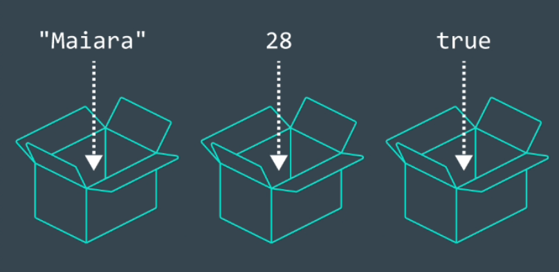

Por rotular, entende-se nomear descritivamente os dados, facilitando
a leitura e entendimento por outras pessoas e nós mesmos.

    `var pessoaUsuaria = 'Maiara';`

    `var idade = 23;`

    `var programando = true;`

# CRIANDO UMA VARIÁVEL: var

A palavra-chave `var` foi usada em todo o código JavaScript de 1995 a 2015, quando
a versão ECMAScript 6 (ES6) introduziu duas novas palavras-chaves para declarar variáveis:
`let` e `const`.

Até então, as pessoas programadores só podiam usar `var`para declarar variáveis.

Atualmente, se você quiser que seu código seja executado em um navegador mais antigo, você
deve usar `var`.

    `var pessoaUsuaria = 'Maiara';
    console.log(pessoaUsuaria);`
--------------------------------
    Terminal:
    `Maiara`
--------------------------------

`var`, abreviação de `variável`, é uma palavra-chave JavaScrpt que declara (cria) uma nova variável;

`pessoaUsuaria`, é o nome da variável. A escrita dessa maneira, onde agrupa-se as palavras em
uma e a primeira palavra é minuscula, e cada palavra que segue tem a primeira letra maiuscula
é uma convenção padrão em JavaScript chamada camel casing (caixa de camelo). 
Outro exemplo: `camelCaseExemplo;`

`=` é o operador de atribuição que atribui(recebe) o valor `('Maiara')` a variável `(pessoaUsuaria);

`'Maiara'` é o valor atribuido `(=)` à variável `pessoaUsuaria`. foi inicializada com o 
o valor de `'Maiara'`.

Após a declaração da variável, o valor da string `Maiara` é impresso no console
utilizando como referência o nome da variável, assim:
`console.log(pessoaUsuaria).`

Existem regas para nomear variáveis:

 - Os nomes das variáveis não podem começar com números;

 - Os nomes das variáveis diferenciam maiscula e minúsculas
 portanto, `pessoaUsuaria` é diferente de `pessoausuaria`.
 Não é uma boa prática criar duas variáveis com o mesmo nome
 utilizando maiúsculas e minúsculas em situações diferentes.

 - Os nomes das variáveis não podem ser iguais às palavras-chave do JavaScript.

# CRIANDO UMA VARIÁVEL: let

A palavra-chave `let` foi introduzida em 2015 na versão ECMAScript 6 (ES6) e sinaliza
que a **variável pode ser reatribuida com um valor diferente**. Por exemplo:

    `let almocoSabado = 'Feijoada';
    console.log(almocoSabado);

    almocoSabado = 'Churrasco';
    console.log(almocoSabado);`
--------------------------------
    Terminal:
    `Feijoada`
    `Churrasco`
--------------------------------

Outro ponto que deve-se observar ao utilizar `let` (e até `var`) é que é possivel declarar
uma variável sem necessariamente atribuir a ela um valor. Dessa forma, a variável será
inicializada como um valor `undefined`. Exemplo:

    `let diaDaSemana;
    console.log(diaDaSemana);

    diaDaSemana = 'Sabado';
    console.log(diaDaSemana);`
--------------------------------
    Terminal:
    `undefined`
    `Sabado`
--------------------------------

No exemplo, inicialmente não foi atribuido um valor à variável `diaDaSemana` e ela
automaticamente inicializou com um valor `undefined`. Em seguida, atribuiu-se o valor
`'Sábado'` a variável.

# CRIANDO UMA VARIÁVEL: const

A palavra-chave `const` também foi introduzida em 2025 na versão ECMAScript 6 (ES6) e 
é uma abreviação da palavra **constante**.

Assim como `var` e `let` também armazenam qualquer valor em uma variável.
A declaração de uma variável `const` segue a mesa estrutura das demais.
Observe abaixo:

    const pessoaUsuaria = 'Bia';
    console.log(pessoaUsuaria);
--------------------------------
    Terminal:
    `Bia`
--------------------------------

A diferença é que a variável `const` não poder ser reatribuida porque é constante.
Ao tentar reatribuir uma variável `const`, obtem-se um `TypeError`.

    const quantidadeDias = 20;
    console.log(quantidadeDias);

    quantidadeDias = 30;
    console.log(quantidadeDias);
--------------------------------
    Terminal:
    `20`
    `TypeError: Assignment to constant variable.`
--------------------------------

Além disso, as variáveis constantes devem receber um valor quando são declaradas.
Ao tentar declarar uma variável `const` sem um valor, obtem-se um `SyntaxError`.

    const quantidadeDias;
    console.log(quantidadeDias);
--------------------------------
    Terminal:
    `ReferenceError: quantidadeDias is not defined`
--------------------------------

Para decidir-se entre qual palavra-chave usar, `let` ou `const`, **pense se**
**será necessário reatribuir um valor à variável no futuro**. Se for preciso
reatribuir a variável `let`, caso contrário, use `const`.

# OPERADORES DE ATRIBUIÇÃO  

Observe como é possível usar variáveis e operadores matemáticos para
calcular novos valores e atribuílos a uma variável:

    let ano = 2021;
    ano = ano + 1;

    console.log(ano);
--------------------------------
    Terminal:
    `2022`
--------------------------------

No exemplo, foi declara a variável `ano` com o número 2021, atribuída a ela.
Na linha seguinte `ano = ano + 1`, aumentando o valor de ano para 2022.

Outra forma de reatribuir `ano`é utilizar operadores de atribuição matemática
embutidos. Pode-se reescrever o código acima da seguinte maneira:

    let ano = 2021;
    ano += 1;

    console.log(ano);
--------------------------------
    Terminal:
    `2022`
--------------------------------

O operador de atribuição embutido `+=` foi utilizado para reatribuir `ano`,
sendo realizada a operação matemática de soma do primeiro operador `+`
com o número à direita e, em seguida, reatribuindo `ano` ao valor calculado.

Estes são outros operadores de atribuição matemática que funcionam de forma
semelhante: `-=, *= e /=`.

    let a = 30;
    a -= 12; // o mesmo que a = a - 12;

    console.log(a);
--------------------------------
    Terminal:
    `18`
--------------------------------

    let b = 24;
    b *= 3; // o mesmo que b = b * 3;

    console.log(b);
--------------------------------
    Terminal:
    `72`
--------------------------------

    let c = 120;
    c /= 2; // o mesmo que c = c / 2;

    console.log(c);
--------------------------------
    Terminal:
    `60`
--------------------------------

# INCREMENTO E DECREMENTO

Dentre os operadores de atribuição matemática inclue-se o operador de incremento
`(++)` e decremento `(--)`.

Observe que o operador de incremento aumenta o valor da variável em 1:

    let alpha = 35;
    alpha++;

    console.log(alpha);
--------------------------------
    Terminal:
    `36`
--------------------------------

Já o operador de decremento diminui o valor da variável em 1:

    let beta = 49;
    beta--;

    console.log(beta);
--------------------------------
    Terminal:
    `48`
--------------------------------

Assim como os demais operadores de atribuiçào matemáticos `(+=, -=, *= e /=)`,
o **valor da variável é atualizado e atribuido como o novo valor dessa variável**.

# CONCATENAR STRINGS E VARIÁVEIS

O operador `+` tabém pode ser usado para combinar dois valores de string, ainda que
esses valores estiverem sendo armazenados em variáveis. Veja a seguir:

    let appFavorito = 'Insta';

    console.log('Uso muito o ' + appFavorito + '!');
--------------------------------
    Terminal:
    `Uso muito o Insta!`
--------------------------------

O valor `Insta` foi atribuido à variável `appFavorito`.	

Em seguida o operador `+` foi usado para combinar três strings: `'Uso muito o '`, 
o valor salvo em `appFavorito` e `'!'`.

Por fim, o valor final da concatenaçào foi registrado no console.

# INTERPOLAÇÃO DE STRINGS

É possivel inserir ou interpolar variáveis em strings usando literais de modelo
(template literals).

Observe no exemplo abaixo como um literal de modelo é usado para registrar strings juntas:

    let appFavorito = 'Insta';

    console.log(`Uso muito o ${appFavorito}!`);
--------------------------------
    Terminal:
    `Uso muito o Insta!`
--------------------------------

 - Um literal de modelo é envolvido por crases ` `` `.

 - Dentro do literal do modelo, há um espaço reservado
 `${appFavorito}`. O valor de `appFavorito` é inserido no literal do modelo.

 **O maior benefício de usar literais de modelo é a legibilidade do código**, facilitando
 identificar qual será a nova string, Além disso, não é necessário preocupar-se com a combinação
 de aspas duplas ou aspas simples.

 # OPERADOR TYPEOF

 O operador typeof verifica o valor à sua direita e retorna (devolve)
 uma string do tipo de dados.

 Por vezes pode ser útil controlar os tipos de dados variáveis no código.

 Caso seja preciso verificar o tipo de dado do valor de uma variável,
 utilize o operador **typeof**

    const pessoaUsuaria = 'Jamile';
    console.log(typeof.pessoaUsuaria);
--------------------------------
    Terminal:
    `string`
--------------------------------

    const idade = 27;
    console.log(typeof idade);
--------------------------------
    Terminal:
    `number`
--------------------------------

    const programando = true;
    console.log(typeof programando);
--------------------------------
    Terminal:
    `boolean`
--------------------------------

# DECLARAÇÕES CONDICIONAIS

Todos os dias, a todo momento, tomamos decisões com base em circusntâncias que
afetam nossas vidas.

Pense por exemplo, que se uma pessoa está com fome, deverá comer um hambúrguer.
Caso contrário comer depois.

As declarações condicionais permitem representar tomadas de decisão como esta
em JavaScript, a partir da escolha que deve ser feita, como "comer hambúrguer" ou
"comer depois".

Essas decisões chamadas de if ... else ( se ... senão ) podem ser tomadas 
em código por meio da criação de instruções condicionais.

Uma instrução condicional verifica uma ou mais condições específicas e executa uma tarefa
com base na condição ou nas condições, caso seja mais de uma.

## Sintaxe básica if ... else

Veja a sintade básica de `if...else` no pseudocódigo:

    `if (condicao) {
        codigo para executar caso a condição seja verdadeira;
    } else {
        senão, executar este código
    }`

### Aqui nós temos:

 1. A palavra reservada `if`seguida de uma condiçãp em parênteseses.

 2. Um teste condicional, localizado dentro dos parênteses.
 (normalmente "este valor é maior que esse", ou "este valor existe"). Esta condição pode fazer uso
 dos operadores de comparação: `==`, `===`, `!=`, `!==`, `>`, `<`, `>=`, `<=`,  e podem retornar
 `true` ou `false`.	

 3. Um par de chaves, e dentro dele temos código -- pode ser qualquer código que queiramos,
 e só vai ser executado se o teste condicional retornar `true`.

 4. A palavra reservada `else`.

 5. Outro par de chaves, dentro dele temos mais um pouco de código -- pode ser qualquer código que queiramos,
 e só vai executar se o teste condicional retornar um valor diferente de `true`, neste caso `not true`, ou `false`.

Este tipo de código é bem legível por seres humanos -- ele diz: **if** a condição for `true`, execute o bloco de código A, **else** 
execute o bloco de código B. (**se** a condição for **verdadeira**, execute o bloco de codigo A, **senão** execute o bloco de codigo B).

### Exemplo:

Para entender bem a sintaxe, vamos considerar um exemplo real. Imagine um filho sendo chamado pra ajudar com as tarefas
do Pai ou da Mãe. Os pais podem falar: "Ei querido, se você me ajudar a ir fazer as compras, eu te dou uma grana extra
para que você possa comprar aquele brinquedo que você quer". Em JavaScript, podemos representar isso como:

    `var comprasFeitas = false;

    if (comprasFeitas === true) {
        var granaFilho = 100;
    } else {
        var granaFilho = 50;
    }`

Esse código como mostrado irá sempre resultar na variável `comprasFeitas`retornando `false`, sendo um
desapontamento para nossas nossas pobres crianças, Cabe a nós fornecer um mecanismo para o pai
definir a variável `comprasFeitas`como `true` se o filho fez as comrpas.

### else if

O último exemplo nos forneceu duas opções ou resultados - mas e se quisermos mais do que dois?

Existe uma maneira de encadear escolhas/resultados extras ao seu `if...else` --- usando `else if`. 
Cada escolha extra requer um bloco adicional para colocar entre `if() {...}` e `else {...}` -- confira
o seguinte exemplo mais envolvido, que pode fazer parte de um aplicativo simples de previsão do tempo:

`HTML

    <label for="wheater">Select the weather type today</label>
    <select id="wheater">
        <option value="">--Make a choice--</option>
        <option value="sunny">Sunny</option>
        <option value="rainy">Rainy</option>
        <option value="snowing">Snowing</option>
        <option value="overcast">Overcast</option>
    </select>

    

    `

`JS

    var select = 
    document.querySelector("select");
    var para = 
    document.querySelector("p");

    select.addEventListener("change", setWeather);

    function setWeather() {
        var choice = select.value;

        if (choice === "sunny") {
            para.textContent = "Today is sunny!";
        } else if (choice === "rainy") {
            para.textContent = "Today is rainy!";
        } else if (choice === "snowing") {
            para.textContent = "Today is snowing!";
        } else if (choice === "overcast") {
            para.textContent = "Today is overcast!";
        } else {
            para.textContent = "";
        }
    }

1. Aqui temos um elemento HTML `<select>` que nos permite fazer escolhas de clima
diferentes e um simples parágrafo.

2. No JavaScript, estamos armazenando uma referência para ambos os elementos
`<select>` e `
` e adicionando um **listener** de evento ao elemento `select`,
para que, quando o valor for alterado, a função `setWeather` seja executada.

3. Quando esta função é executada, primeiro definimos uma variável chamada `choice`,
para o valor atual selecionado no elemento `select`. Em seguida, usamos uma
instruçào condicional para mostrar um texto diferente dentro do parágrafo,
dependendo de qual é o valor de `choice`. Observe como todas as condições
são testadas nos blocos `else if() {...}`, com exceção do primeiro, que 
é testado em um bloco  `if() {...}`.

4. A última escolha, dentro do bloco `else{...}`, é basicamente uma opções de "último recurso" --- o 
código dentro dele será executado se nenhuma das condições anteriores forem `true`. Nesse caso, ele
serve para esvaziar o texto do parágrafo, se nada for selecionado, por exemplo, se um usuário decidir
selecionar novamente a opção de espaço reservado "--Make a choice--" mostrada no inicio.

# DECLARAÇÃO if

Constantemente decidimos realizar uma tarefa tendo como base uma condição: se estiver frio,
vou usar uma blusca; se chover, levo um guarda-chuva; se estiver com sono, durmo.

Ao programar, também é possivel realizar uma tarefa baseando-se em uma condição.
Para isso, utiliza-se a instrução `if`:

    if (true) {
        console.log('Vou usar uma blusa');
    }
--------------------------------
    Terminal:
    `Vou usar uma blusa`
--------------------------------

No exemplo:

A palavra-chave `if` é seguida por um conjunto de parênteses () que é seguido por um bloco de código,
ou instrução de bloco, indicada por um conjunto de chaves {}.

dentro dos parênteses (), é fornecida uma condição que avalia para `true`ou `false`.

se a condição for avaliada como `true`, o código dentro das chaves {} é executado.

se a condição for avaliada como `false`, o código dentro das chaves {} não é executado.

    if (false) {
        console.log('Vou usar uma blusa');
    }
--------------------------------
    Terminal:

--------------------------------   

# DECLARAÇÃO If ... Else

Sabe-se que uma instrução `if` permite verificar uma condiçào e decide se um bloco de código deve
ser executado quando a condição é avaliada como `true`.

Em alguns casos, pode ser que queiramos que um outro bloco de código seja executado, caso a condição seja avaliada como `false`.

Para adicionar um comportamento padrão à instrução `if`, adicione uma instrução `else`para executar um bloco de código quando a
condição for avaliada como `false`.

observe o exemplo:

    if (false) {
        console.log('Vou usar uma blusa');	
    } else {
        console.log('Não preciso da blusa');
    }
--------------------------------
    Terminal:
    `Não preciso da blusa`
--------------------------------

Uma declaração `else`deve ser utilizada como complemento à uma declaração `if` e, juntas
são chamadas de declaração `if ... else`.

No exemplo:

 - A palavra-chave `else` foi adicionada após o bloco de código de uma instrução `if`.

 - Possui um bloco de código que é envolvido por um conjunto de chave `{ }`.	

 - O código dentro do bloco de código da instrução `else`foi executado quando a condição da instrução `if`
 foi avaliada como `false`.

Declarações `if ... else`permitem automatizar soluções para decisões binárias, como por exemplo,
**perguntas de sim ou não**.

# OPERADOS DE COMPARAÇÃO

Utiliza-se operadores de comparação quando é preciso comparar valroes ao escrever declarações condicionais.

Alguns operadores de comparaçào e suas sintaxes são:

 - menor que: <
 - maior que: >
 - igual a: ==
 - Exatamente igual a: ===
 - diferente de: !=
 - maior ou igual a: >=
 - menor ou igual a: <=

Os operadores de comparação comparam o valor à esquerda com o valor à direita. Por exemplo:

    100 > 50 // true

Declarações de comparação podem ser entendidas como perguntas. Quando a resposta for "sim",
a afirmação avaliada para `true`, e quando a resposta for "não", a afirmação avaliada para `false`.

O exemplo acima teria como pergunta: `100` é maior que `50`? Sim, portando `100 > 50` é avaliado como `true`.

É possível usar operadores de comparação em diferentes tipos de dados, comos trings:

    'suco' == 'refrigerante' // false

O operadores de identidade `(==)` verifica se a string `'suco'`é igual à string `'refrigerante'`.
Como as duas strings não são iguais, a instruçào de comparação avalia como `false`.

Todas as declarações de comparação avaliam `true` ou `false` e são compostas de:

 - Dois valores que serão comparados.
 - Um operador que separa os valores e os compara (>, <, <=, >=, ===, e !==).

# OPERADORES LÓGICOS

Em JavaScript, os operadores lógicos adicionam uma lógica mais sofisticada às condicionais,
isto é, quando utilizamos valores booleanos, `true` ou `false`.

Há três tipos de operadores lógicos:

 - Operador **e** `(&&)`: Retorna `true`se ambas as condições forem avaliadas como `true`.
 - Operador **ou** `(||)`: Retorna `true`se pelo menos uma das condições forem avaliadas como `true`.
 - Operador **not**, também conhecido como operador *bang* `(!)`: Retorna `true`se a condição for avaliada como `false`.

Para verificar se dois elementos são `true`, utiliza-se o operador `&&`:

    if (clima === 'chuvoso' && temperatura  15){
        console.log('Use um casaco impermeável!`);
    } else {
        console.log('Use apenas um suéter.');
    }

O operador `&&` verifica ambas as condições que devem ser avaliadas como `true` para que toda a condiçào seja avaliada como `true` e,
assim, executar o bloco de código `if`.

Caso uma das condições seja avaliada como `false`, a condição `&&` também será avaliada como `false`e o bloco de código `else` será executado.

Se apenas uma das duas condições precisar ser avaliada como `true`, utilize o operador `||`.

    if (nome === 'Ana' || nome === 'ana) {
        console.log('Boas-vindas, Ana!');
    } else {
        console.log ('Boas-vindas, ' + nome + '!');
    }

Ao usar o operador ` || `, apenas uma das condições deve ser avaliada como `true` para que a instrução geral também seja avaliada como `true`.

No exemplo, se `nome === 'Ana'` ou `nome === 'ana'` for avaliada como true, a condição `if` será avaliada como `true` e seu bloco de código será executado.

Se a primeira condição em uma instrução `||` for avaliada como `true`, a segunda condição nem mesmo será verificada. Somente se `nome === 'Ana'` for avaliada como `false`
é que `nome === 'ana'` será verificada.

O bloco de código na instrução `else`será executado somente se ambas as comparações em `if`forem avaliadas como `false`.

O operador not `(!)` inverte ou nega um valor booleano:

    let programando = false;
    console.log(!programando);
--------------------------------
    Terminal:
    `true`
--------------------------------

    let sonolento = true;
    console.log(!sonolento);
--------------------------------
    Terminal:
    `false`
--------------------------------

O operador `!` inverte um valor `true`para `false`, e um valor `false` para `true`.

Outra camada de lógica é adicionada ao código quando operadores lógicos são utilizados em
declarações condicionais.

# VALORES VERDADEIROS OU FALSOS

Tipos de dados não booleanos, como strings ou números, também podem ser avaliados quando verificados em uma condição.

Por vezes é necessário apenas verificar se há um valor na variável e não necessariamente verificar se esse valor é igual a um valor
especifico.

Ela deverá apenas ter um valor, seja ele qual for, em outras palavaras, é necessário apenas verificar se a variável recebeu um valor.

    let verificarValor = 'Aqui existe um valor!';	

    if (verificarValor){
        console.log(verificarValor);
    } else {
        console.log('Não existe um valor!');
    }
--------------------------------
    Terminal:
    `Aqui existe um valor!`
--------------------------------

O bloco de código na instrução `if`foi executado por `verificarValor` tem um valor verdadeiro.

Mesmo que o valor de `verificarValor` não seja explicitamente o valor `true`, quando usado em um contexto
booleando ou condicional, ele é avaliado como `true` porque foi atribuído um valor não falso.

Então, quais valores são falso - ou avaliado como `false` - quando verificados como uma condição?

A lista de valores falsos inclui:

 - `0` (zero)
 - strings variaz como " " ou ' '
 - `null` (nulo) quando não há valor algum
 - `undefined` (indefinido) quando há uma variável é declarada sem valor
 - `NaN` (not a number) ou não é um número
 - `false`

Observe um exemplo com o número `0`:

    let pessoasNaSala = 0;

    if (pessoasNaSala) {
        console.log('Manter a sala aberta');
    } else {
        console.log('Fechar a sala');
    }
--------------------------------
    Terminal:
    `Fechar a sala`
--------------------------------

A condição é avaliado como `false`porque o valor de pessoasNaSala é `0`. Como `0` é um valor falso, o bloco de código na instrução `else` será executado.

# ATRIBUIÇÃO DE VERDADE OU FALSO

Numa situação, por exemplo, em que seja preciso saudar uma pessoa usuária de forma
personalziada utilizando seu nome, mas com a possibilidade dela ainda não ter uma conta
tornando o `nomeUsuario` uma variável falsa, avaliações verdaderias e falsa (truthy and falsy)
simplificam bastante as coisas.

Obsever no código abaixo como seria na prática. Ele verifica se `nomeUsuario` foi definido,
e caso nenhum valor tenha sido fornecido, atribui uma string padrão.

    let nomeUsuario = '';
    let nomePadrao;

    if (nomeUsuario){
        nomePadrao = nomeUsuario;
    } else {
        nomePadrao = 'novo usuário';
    }

    console.log(nomePadrao);
--------------------------------
    Terminal:
    `novo usuário`
--------------------------------

É possivel abreviar o código acima utilizando o operador lógico `||` em uma condição booleana:

    let nomeUsuario = '';
    let nomePadrao = nomeUsuario || 'novo usuário';

    console.log(nomePadrao);
--------------------------------
    Terminal:
    `novo usuário`
--------------------------------

A instrução `||` verificou a condição do lado esquerdo primeiro. Como o valor de `nomeUsuario`(`if`) foi atribuido como `false` (`''`), a instrução
`else`com `'novo usuário'` foi avaliada como `true`e executada.

Este conceito também é conhecido como avaliação de curto-circuito. (Short Circuit Evaluation)

# OPERADOR TERNÁRIO

Com uma sintaxe abreviada que simplifica uma instrução `if ... else `, o operador ternário é como um atalho.

Veja a declaração `if ... else` a seguir:

    let noite = true;

    if(noite){
        console.log('Acender as luzes.');
    } else {
        console.log('Apagar as luzes.');
    }
--------------------------------
    Terminal:
    `Acender as luzes.`
--------------------------------

Utilizando o operador ternário, é possível escrever o mesmo
código de forma simplificada mantendo a mesma funcionalidade. Observe:

    let noite = true;

    noite ? console.log ('Acender as luzes.') 
    : console.log('Apagar as luzes.');
--------------------------------
    Terminal:
    `Acender as luzes.`
--------------------------------

 - A condição `noite` foi fornecida antes de `?`.

 - Duas expressões segue o `?` e são separadas por dois pontos : .

 - Se a condição for avaliada como `true`, a primeira expressão será executada.

Assim como as declarações `if ... else` , os operadores ternários são usados em condições
para avaliar valores como `true` ou `false`.

# DECLARAÇÕES Else If

É possível adicionar mais condições `if ... else` com uma declaração `else if`.

A declaração `else if` permite mais de dois resultados possíveis, criando condicionais
mais complexas com quantas instruçòes `else if` forem necessárias.

A declaração `else if` sempre vem depois da declaração `if`e antes da declaração `else`.

A declaração `else if` também exige uma condição. Veja a sintaxe:

    let clima = 'Nublado';

    if (clima === 'chuvoso') {
        console.log('🌧️');
    } else if (clima === 'nublado') {
        console.log('☁️');
    } else if (clima === 'Sol com nuvens') {
        console.log('⛅');
    } else (clima === 'Ensolarado') {
        console.log('☀️');
    }
--------------------------------
    Terminal:
    `☁️`
--------------------------------

As declarações else if permite vários resultados possíveis.

Instruções `if/ else if/` else são lidas de cima para baixo, então a primeira condição avaliada como true de cima para baixo
é o bloco que será executado.

No exemplo, uma vez que clima === 'Chuvoso'
foi avaliado como false e clima ==== 'Nublado'
avaliado como true, o código dentro da primeira instrução `else if` foi executado.

As demais condições não foram avaliadas.

Caso nenhuma das condições fosse avaliada como true, o código da instrução else teria sido executado.

# SWITCH

Ao programar, por vezes é necessário verificar vários valores e lidar com cada um de maneira diferente, sendo as declarações `else if`
excelentes para situações assim. Veja:

    let estacao = 'Verao';

    if (estacao === 'Primavera') {
        console.log ('É primavera! As flores estão brotando');
    } else if (estacao === 'Outono') {
        console.log ('É outono! O inverno está a caminho');
    } else if (estacao === 'Verao') {
        console.log ('É verao! Está quente e ensolarado');
    } else {
        console.log ('Não é essa estação?');
    }
--------------------------------
    Terminal:
    `É verao! Está quente e ensolarado`
--------------------------------

Temos uma série de condições verificando um valor que corresponda à variável `estacao`.

O código funciona bem, mas imagine se fosse preciso verificar 100 valores diferentes?

Ter que escrever tantos declarações `else if` seria **contraprodutivo**.

Uma instrução `switch` fornece uma sintaxe alternativa que é mais fácil de ler e escrever.

A declaração `switch` é escrita da seguinte maneira:

    let estacao = 'Verao';

    switch (estacao) {
        case 'Primavera':
            console.log ('É primavera! As flores estão brotando');
            break;
        case 'Outono':
            console.log ('É outono! O inverno está a caminho');
            break;
        case 'Verao':
            console.log ('É verao! Está quente e ensolarado');
            break;
        default:
            console.log ('Não é essa estação?');
            break;
    }
--------------------------------
    Terminal:
    `É verao! Está quente e ensolarado`
--------------------------------

A palavra-chave `switch` inicia a instrução e é seguida por `(...)`, que contém o valor que cada
`case`irá comparar. No exemplo, o valor ou expressão da instrução `switch` é `estacao`.

Dentro do bloco `{...}`, existem vários `cases`.

A palavra-chave `case` verifica se a expressão corresponde ao valor especificado que vem depois dela.

 O valor após o primeiro `case`é `'Primavera'`.
 Se o valor de estacao fosse igual a `'Primavera'`, o console.log() do `case` seria executado.

 O valor de estacao é `'Verao'`, portando, o terceiro `case` foi executado e `É verao! Está quente e ensolarado` foi exibido no console.

A palavra-chave `break` diz ao computador para sair do bloco e não executar mais nenhum código ou verificar qualquer outro `case`dentro do bloco de código.

Sem a palavra-chave `break`, o primeiro `case` correspondente será executado, mas o mesmo acontecerá com todas os `cases`subsequentes,
independentemente de haver correspondência ou não - incluindo o `default`.

Esse comportamento é diferente de instruções `if ... else` em condicionais que executam apenas um bloco de código.

Ao final de cada declaração `switch`, há uma declaração `default`. Se nenhum dos `cases`for verdadeiro`, o código da instrução `default` será executado.

# O QUE SÃO FUNÇOES?	
 
Uma função é um bloco de código reutilizável que agrupa uma sequência de instruções para executar uma tarefa específica
ou calcular um valor.

Pense que para calcular a área de um retângulo há uma sequência de etapas para chegar na resposta correta:

 1. Medir a largura do retângulo.
 2. Medir a altura do retângulo.
 3. Multiplicar a largura pelo valor da altura.

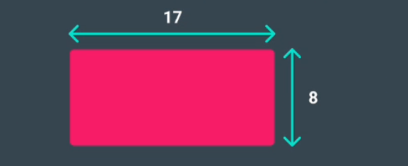

Assim, é possivel calcular a área do retângulo acima com o seguinte código:

    const largura = 17;
    const altura = 8;
    const area = largura * altura;

    console.log(area);
--------------------------------
    Terminal:
    `136`
--------------------------------

Agora, imagine se for preciso calcular a área de três retângulos diferentes.

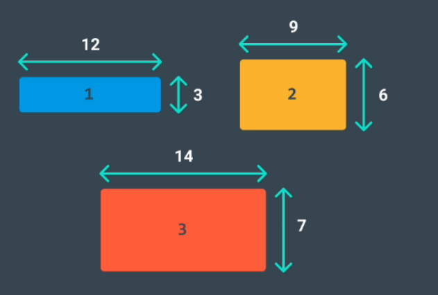

    //área do retângulo 1
    const largura1 = 12;
    const altura1 = 3;
    const area1 = largura1 * altura1;

    console.log(area1);
    
    //área do retângulo 2
    const largura2 = 9;
    const altura2 = 6;
    const area2 = largura2 * altura2;

    console.log(area2);

    //área do retângulo 3
    const largura3 = 14;
    const altura3 = 7;
    const area3 = largura3 * altura3;

    console.log(area3);
--------------------------------
    Terminal:
    `36`
    `54`
    `98`
--------------------------------

Em vez de reescrever o mesmo código ao programar deve-se criar um código para realizar uma tarefa
específica várias vezes.

Assim, é possível agrupar um bloco de código e associá-lo a uma tarefa, e então reutilizar esse 
bloco de código sempre que for preciso realizar a tarefa novamente.

Para isso cria-se uma função, isto é, um bloco de código reutilizável que agrupa uma
sequência de instruções para realizar uma tarefa específica.

# DECLARAÇÕES DE FUNÇÕES

Existem diferentes maneiras de criar funções em JavaScript. Uma delas é a declaração de função.

Assim como uma declaração de variável, uma declaraçào de função associa uma função a um nome ou
identificador.

Conheça a anatomia de uma declaração de função:

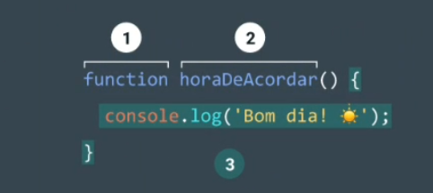

 1. A palavra-chave `function`.
 2. Identificador seguido por parênteses
 3. corpo da função entre chaves

Uma declaraçào de função é uma função associada
a um identificador ou nome.

# CHAMANDO UMA FUNÇÃO

A declaração de função vincula uma função a um identificador.

Todavia, uma declaração de função não diz que o código dentro do corpo da função deve ser
executado, apenas declara a existência da função.

O código dentro do corpo de uma função é executado quando a função é chamada.

O nome da função deve ser seguido por parênteses () para chamar uma função no código.

A chamada de função executa o corpo da função ou todas as instruções entre as chaves 
na declaração da função.

    function horaDeAcordar() {
        console.log(`bom dia! ☀️`);
    }

    horaDeAcordar();
--------------------------------
    Terminal:
    `bom dia! ☀️`
--------------------------------

É possivel chamar a mesma função quantas vezes forem necessárias.

# PARAMETROS E ARGUMENTOS

Algumas funções podem receber entradas e usar as entradas para realizar uma tarefa.

Ao declarar uma função, é possivel especificar seus parâmetros.

Os parâmetros permitem que as funções aceitem a(s) entrada(s) e executem uma tarefa usando a(s) entrada(s).

Parâmetros são como espaços reservados para informações que serão passadas para a função
quando ela for chamada.

Observe como especificar parâmetros em uma declaração de função:	

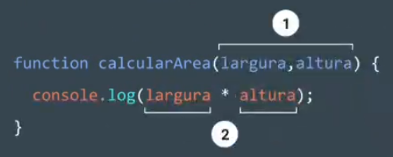

 1. Parâmetros
 2. Parâmetros tratados como variáveis.

`calcularArea()`calcula a área de um retângulo com base em duas entradas: `largura` e `altura`.

Os parâmetros são especificados entre parênteses como `largura` e `altura`, e dentro do corpo
da função eles agem como variáveis regulares.

`largura` e `altura` atuam como substitutos de valores que serão multiplicados juntos.

Ao chamar uma função que possui parâmetros, deve-se especificar os valores entre parênteses
que seguem o nome da função.

Os valores que são passados para a função quando ela é chamada são chamados de argumentos.
Os argumentos podem ser passados para a função como valores ou variáveis.

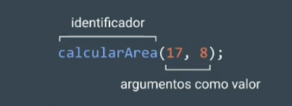

Na chamada de função `calcularArea()` acima, o número `17` foi passado como `lagura` e `8`
foi passado como `altura`.	

Atente-se pois a ordem em que os argumentos são passados e atribuidos segue a ordem em que
os parâmetros são declarados.

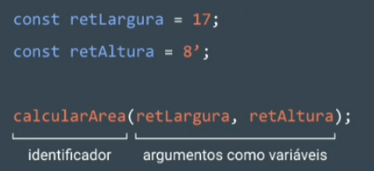

As variáveis retLargura e reAltura foram inicializadas com os valores de altura e largura,
de um retângulo antes de serem usadas na chama de função,

Usando parâmetros, calcularArea() pode ser reutilizado para calcular a áea de qualquer retângulo!

Funções são uma ferramente poderosa na programção de computadores.

# PARÂMETROS PADRÃO

Parâmetro padrão é um dos recursos adicionados no ES6 e que permite que os parâmetros tenham um valor
predeterminado no caso de nenhum argumento ser passado para a função ou se o argumento for
`undefined` quando chamado.

Observe o snippet (trecho) de código abaixo que usa um parâmetro padrão:

    function saudacao (nome = 'novo usuario') {
        console.log(`olá, ${nome}!`);
    }

    saudacao('Yoshi');
    saudacao();
--------------------------------
    Terminal:
    olá, Yoshi!
    olá, novo usuario!
--------------------------------

 - O operadores `=` atribuiu ao parâmetro `nome` um valor padrão de `'novo usuario'`.

 - Quando o código chamado `saudacao('Yoshi') o valor do argumento é passado e
 'Yoshi' substitui o parâmetro padrão de `'novo usuario'` para registrar `olá, Yoshi!` no
 console.

 - Quando não é passado um argumento para `saudacao(), o valor padrão de `novo usuario` é usado e
 `olá, novo usuario!` é registrado no console.

Em situações em que um argumento não é passado para uma função que está esperando um argumento, 
utilizamos um parâmetro padrão.

# RETONAR (RETURN)

O código de uma função é executado e avaliado por padrão como ` undefined`quando uma função é chamada.

    function areaRetangulo (largura, altura) {
        let area = largura * altura;
    }

    console.log(areaRetangulo(17, 8));
--------------------------------
    Terminal:
    undefined
--------------------------------

No exemplo, foi definida uma função para calcular `area` com parâmetros de `largura` e `altura`.

Em seguida, `areaRetangulo()` foi chamada com os argumentos `17` e `8`. Porém, o resultado 
registrado foi `undefined`.

A Função não está errada. Ela funcionou bem e a área foi calculada como `136`, só que o valor 
não foi capturado e retornado.

Para retornar o valor do cálculo devemos usar a palavra-chave `return`.

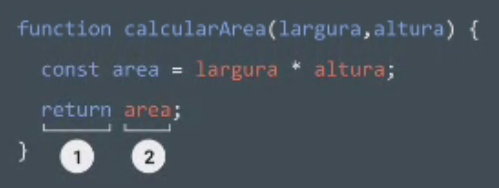

 1. A palavra-chave `return`.
 2. Valor a ser retornado.

Para passar de volta informações da chamada de função, utiliza-se uma instrução de retorno.

Para criar uma instrução de retorno, utiliza-se a palavra-chave `return` seguida pelo valor
que deve ser retornado. Se o valor for omitido, ele vai retornar `undefined`.	

Quando uma instrução `return` é usada no corpo de uma função, a execução é interrompida
e o códdigo que a segue não será executado:

    function areaRetangulo(largura, altura) {
        if (largura < 0 || altura < 0) {
            return 'Os números devem ser inteiros positivos para calcular a área!';
        }
        return largura * altura;
    }

Se o argumento para `largura` ou `altura`for menor que `0`, `areaRetangulo()` retornará
a string `'Os números devem ser inteiros positivos para calcular a área!'`.

A segunda instrução do retorno `largura * altura` não será executada.

A palavra-chave `return`permite que funções produzam uma saída que pode, inclusive, 
ser salva em uma variável para uso posterior.

# FUNÇÕES AUXILIARES

Também é possível usar o valor de retorno de uma função dentro de outra função.

Essas funções sendo chamadas dentro de outra função são conhecidas como **funções auxiliares**.

Como cada função realizar uma tarefa específica, toma o código mais fácil de ler e depurar, se necessário.

Para definir uma função que converta a temperatura de Celsius para Fahrenheit, por exemplo, pode-se escrever
duas funções como:

    function multiplicarPorNoveQuintos(numero) {
        return numero * (9/5);
    };

    function obterFahrenheit(celsius) {
        return multiplicarPorNoveQuintos(celsius) + 32;
    };

    obterFahrenheit(15);
--------------------------------
    Terminal:
    `59.0`
--------------------------------

 - `obterFahrenheit()` foi chamado passando `15` como um argumento.

 - o código dentro de `obterFahrenheit()` chamou `multiplicarPorNoveQuintos()` passando `15` como um argumento.	

 - `multiplicarPorNoveQuintos()` leva o argumento de `15`para o parâmetro numero.

 - o bloco de código dentro da função `multiplicarPorNoveQuintos()` multiplica `15` por 9/5, que o avalia como `27`, a conta é feita da seguinte maneira `(15 * 9) /5`.

 - `27` é retornado para a chamada de função em `obterFahrenheit()`.

 - `obterFahrenheit()` continua a executar.
 Acrescenta `32` a `27`, que avalia a 59.

 - Finalmente, `59` retorna à chamada de função obterFahrenheit(15).

Funções podem ser usadas para separar pequenos pedações de lógica ou taredas e, em seguida, usá-los quando necessário.

Escrever funções auxiliares pode ajudar a pegar tarefas grandes e difíceis e dividi-las em tareas menores e mais gerenciáveis.

# EXPRESSÕES DE FUNÇÃO

Expressão de função é mais uma forma de definir uma função.

Para defirnir uma função dentro de uma expressão, pode-se usar a palavra-chave `function`.

Em uma expressão de função, o nome da função geralmente é omitido. Uma função sem nome é 
chamada de função anônima.

Uma expressão de função geralmente é armazenada em uma variável para fazer referência a ela.

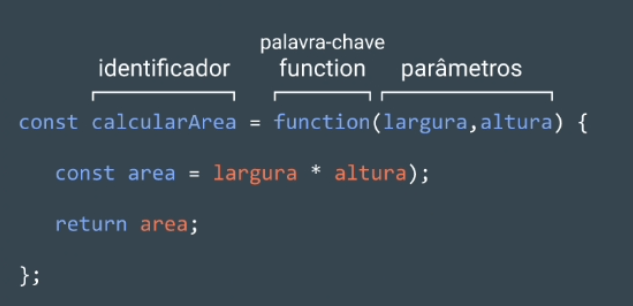

Ao declarar uma expressão de função:

Declare uma variável para que o nome da variável seja o nome, ou identificador, da função.
Desde o lançamento do ES6, é prática comum usar `const`como plavra-chave para declarar uma variável.

Atribua como valor dessa variável uma função anônima criada usando a palavra-chave `function` seguida
por um conjunto de parênteses () com parâmetros possíveis. Em seguida, um conjunto de chaves que 
contém o corpo da função.

    nomeDaVariavel(argumento1, argumento2)

# FUNÇÕES DE SETA (arrow functions)

A versão ES6 introduziu a sintaxe da `Arrow Function`, ou função de sete, que nada mais é do que uma maneira
mais curta de se escrever funções usando uma anotação especial de `seta grande` `() => `.

As arrow functions eliminan a necessidade de digitar a palavra-chave `function` toda vez que for
preciso cirar uma função. Em vez disso, primeiro inclui-se os parâmetros dentro de `( )` e, em seguida,
adicion-ase uma seta `=>` que aponta para o corpo da função circundando `{}` assim:

    const areaRetangulo = (largura, altura) => {
        lete area = largura * altura;
        return area;
    };

É importante familiarizar-se com as várias maneiras de escrever funções, pois cada uma delas
está presente em outro código JavaScript.

# FUNÇÕES CONCISAS

Existe outras formas de refatorar a sintaxe da arrow function em JavaScript.

A forma mais condensada da funçõa é conhecida como `corpo conciso`.

 1. Funções que usam apenas um único
 parâmerto não precisam que esse
 parâmetro seja colocado entre parênteses.
 No entanto, se uma função tiver zero ou
 vários parâmetros, os parênteses são 
 necessários.

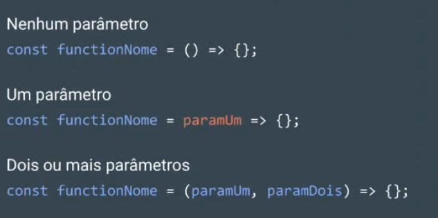

 2. Um corpo de função composto por um bloco
 de linha única não precisa de chaves. Sem
 as chaves, tudo o que essa linha avaliar será
 retornado automaticamente. O conteúdo do 
 bloco deve seguri imediatamente a seta `=>`
 e a palavra-chave `return` pode ser removida.
 Isso é conhecida como `retorno implícito`.

 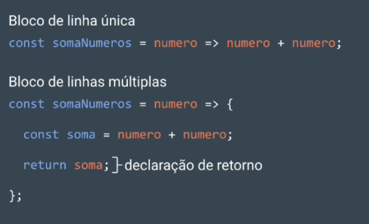

Assim, uma função:

    const NumQuadrado = (num) => {
        return num * num;
    };

Pode-se refatorar para:

    const NumQuadrados = num => num * num;

Sendo que as mudanças foram:

 - Os parâmetros ao redor de `num`foram
 removidos, pois há um único parâmetro.

 - As chaves `{}` foram removidas, pois 
 a função consiste em um bloco de linha única.

 - A palavra-chave `return` foi removida, pois a 
 função consiste em um bloco de linha única.

 # O QUE SÃO ARRAYS?

 Arrays, ou matrizes, são listas que armazenam dados em JavaScript.

 Os arrays podem armazenar qualquer tipo de dados (incluindo strings, números e booleanos).

 Como as listas, os arrays são ordenados, o que signifca que cada item tem uma posição numerada.

 Organizar e armazenar dados é um conceito básico de programação.

 Uma maneira de organizar os dados na vida real é fazendo listas. Por exemplo:

Resoluções Ano Novo:
 1. Praticar programação com o Motiro
 2. Evoluir na língua inglesa
 3. Obter o trabalho dos sonhos

Agora, essa mesma lista escrita em JavaScript,
como um array.

    let resolucoesAnoNovo = ['Praticar programação com o Motiro', 
    'Evoluir na lingua inglesa', 'Obter o trabalho dos sonhos'];

    console.log(resolucoesAnoNovo);
-------------------------------------

    Terminal: 

    ['Praticar programação com o Motiro', '
    Evoluir na lingua inglesa', 'Obter o trabalho dos sonhos']

------------------------------

# CRIANDO UM ARRAY

Uma forma de criar uma array é usar um *literal de array*, que cria um array
envolvendo os itens entre colchetes `[]`.

Como arrays podem armazenar qualquer tipo de dados, um array pode conter todos
os mesmo tipos de dados ou tipos diferentes de dados.

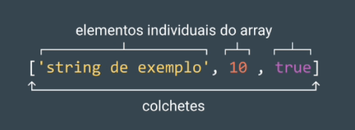

 - O array é representado por colchetes `[]` e o conteúdo dentro.

 - Cada item de conteúdo dentro de um array é chamado de elemento.

 - Existem três elementos diferentes dentro da matriz.

 - Cada elementro dentro da matriz é um tipo de dado diferente.

Um array também pode ser salvo em uma variável.

    cosnt passatempos = ['Correr no parque', 'Jogar futebol', 'Estudar'];	

# ACESSANDO ELEMENTOS

Cada elemento em um array possui uma posição numerada conhecida como index (indice).

É possivel acessar itens individuais usando seu index, que é o mesmo que fazer 
referência a um item em uma lista com base na posição do item.

Os arrays em JavaScript são indexados por zero, o que signifca que as posições	
começam a constar a partir de `0` em vez de `1`.

Portanto, o primeiro item em um array está na posição `0`. Vamos ver como podemos
acessar um elemento em um array:

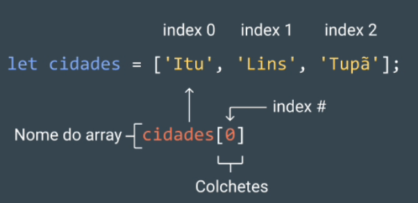

 -`cidades`é um array com tres elementos.

 - foi usada a notação de colchetes `[]`, com o index após
 o nome do array para acessar o elemento.

 -`cidades[0]` acessa o elemento no `index 0` do array `cidades`,
 ou seja, `cidades[0]` acessar o espaço na memória que contém
 a string `'itu'`.

Também é possivel acessar caracteres individuais em uma string 
usando a notação de colchetes e o index. Por exemplo:

    const boasVindas = 'Boas-vindas ao README!';
    console.log(boasVindas[8]);
--------------------------------
    Terminal:
    `d`
--------------------------------

`d` foi exibino do console. pois é o caractere que está no index `8`.

# ATUALIZAÇÃO DE ELEMENTOS

Depois de ter acesso a um elemento de uma array, é possivel atualizar seu valor.

    const carrosEletricos = ['BMW', 'Mercedes', 'Audi'];

    carrosEletricos[2] = 'Volkswagen';
    console.log(carrosEletricos);
--------------------------------
    Terminal:
    [`BMW`, `Mercedes`, `Volkswagen`]
--------------------------------

No exemplo, o array `carrosEletricos` continha o nome
de três marcas de carros.

No entando decidiu-se substituir no array o elemento `Audi` por `Volkswagen`.

A linha `carrosEletricos[2] = 'Volkswagen';` diz ao programa para alterar o item no index 2
do array `carrosEletricos`para ser `'Volkswagen'`. em vez do que já está lá.

# ARRAYS COM LET E CONST

Sabe-se que variaveis declaradas com `let` podem ser reatribuidas e que variáveis
declaradas com o `const` não podem ser reatribuidas.

No entanto, os elementos em um array declarado com `const` permanecem mutáveis.

O que signifca que é possivel alterar o conteúdo de um array `const`, mas não reatribuir
um novo `array`ou um valor diferente.

# A PROPRIEDADE .length

Uma das propriedades integradas de um array é `.length` que retorna o número de
itens presentes no array.

A forma de acessar a propriedade `.length` é exatamente igual a forma usar 
para acessar em strings:

    const objetivos2024 = ['Aprender uma nova lingua', 'ler 30 livros', 'emagrecer', 'viajar para o exterior'];

    console.log(objetivos2024.length);
--------------------------------
    Terminal:
    `4`
--------------------------------

 - A propriedade `.length` acessou o array `objetivos2024`.

 - Em seguida, registrou o `.length` de `objetivos2024` no console.

 - uma vez que `objetivos2024` tem quatro elementos, o número `4` foi registrado no
 console.

Para saber quantos elementos existem em um array, pode-se acessar a propriedade `.length`.

# O MÉTODO .push()

Em JavaScript existem alguns métodos integrados que facilitam o trabalho com arrays.

Esses métodos são chamados especificamente em arrays para tornar as tarefas comuns, como
adicionar e remover elementos, mais diretas.

Um método `.push()` permite adicionar itens ao final de um array:

    const itens = ['item 0', 'item 1', 'item 2'];
    itens.push('item 3', 'item 4');
    console.log(itens);
--------------------------------
    Terminal:
    [`item 0`, `item 1`, `item 2`, `item 3`, `item 4`]
--------------------------------

 - O método `.push()` foi chamada como uma função porque `.push()`é uma função que o JavaScript permite usar diretamente
 em um array.

 - `.push` pode receber um único argumento ou varios argumentos separadas por vírgulas.
 Nesse caso, foram adicionados dois elementos: `'item 3'` e `'item 4'` em itens.

 - Observe que `.push` transforma itens alterando o array inicial.

Em suma, `.push()` é um método que modifica um array adicionando elementos a ele.

# O MÉTODO .pop()

Outro método integrado é o `.pop()`, que remove o último item de um array:

    const itens = ['item 0', 'item 1', 'item 2'];

    const remover Itens = itens.pop();

    console.log(itens);

    console.log(removerItens);
--------------------------------
    Terminal:
    [`item 0`, `item 1`]
    `item 2`
--------------------------------

 - Ao chamar `.pop()`o elemento `item 2` foi removido do final do array `itens`.

 -`.pop()` retonar o valor do último elemento. No exemplo, o valor retornado foi
 armazenado na variável `removerItens` para ser usado posteriormente.

 - `.pop()`é um método que altera o array inicial.

Em resumo, `.pop()` transforma um array removendo o último elemento.

# MAIS MÉTODOS DE ARRAY

`.pop()`e `.push()` transformam o array no qual são chamados. No entanto, há
momentos em que não queremos transformar o array original e podemos usar 
métodos de array não mutantes.

`verificar Mozilla Developer Network para entender o comportarmento de alguns dos métodos de array`

Alguns métodos de arrays que estão disponivies para pessoas desenvolvedora de JavaScript
incluem: `.join(), .slice(), .splice(), .shift(), .unshift() e .concat()` entre muitos outros.
O uso desses métodos integrados torna mais fácil realizar algumas tarefas comuns ao trabalhar com arrays.

Existem muitos outros métodos de array além de `.push()`, `.pop()` e dos supracitados.

# ARRAY E FUNÇÕES

Existem arrays mutáveis ou não mutáveis.

O que acontece ao tentar alterar um array dentro de uma função?

O array mantém a alteração após a chamada da função ou seu espaço 
matém-se dentro da função?

Veja o exemplo a seguir, onde `.push()` é chamado no array dentro de uma função:

Lembre-se de que o método `.push()` sofre mutação ou altera um array:

    const flores = ['tulipa', 'rosa', 'lirio'];

    function adicionarFlor(novaFlor) {
        novaFlor.push('peônia');
    }

    adicionarFlor(flores);

    console.log(flores);
--------------------------------
    Terminal:
    [`tulipa`, `rosa`, `lirio`, `peônia`]
--------------------------------

 - O array `flores` possui 3 elementos.

 - A função `adicionarFlor` tem um parâmetro nomeado como `novaFlor`. Foi usado
 o método `.push()` para adicionar o elemento `'peônia'` ao elemento novaFlor.

 - Ao registrar `flores` no console, o elemento `peônia` foi inclu;ido, ou seja
 o array sofre uma mutação.

Portanto, se um array passado para a função sofrer mutação dentro da função, essa mudança
também será mantida fora da função.

Esse conceito também pode ser explicado como **passagem por referência**, uma vez que
é realmente passado para a função é uma referência para onde a memória variável está
armazenada e alterando a memória.

# ARRAYS ANINHADOS (Nested arrays)

Arrays podem armazenar outros arrays. Quando um array contém outro array, é chamado
de **array aninhado** ou **nested arrays**, em inglês

Exemplo:

    const arrayAninhado = [['A'], ['B', 'C']];

Para acessar os arrays aninhados, use a notação de colchestes com o valor do indes, 
assim como é feito para acessar qualquer outro elemento:

    const arrayAninhado = [['A'], ['B', 'C']];
    console.log(arrayAninhado[1]);
--------------------------------
    Terminal:
    `[B, C]`
--------------------------------

O `arrayAninhado[1]` retornou o elemento no index 1, que é o array `[B, C]`.

Assim para acessar elementos em arrays aninhados, é possível adicionar mais
notações de colchetes com valores de index.

    const arrayAninhado = [['A'], ['B', 'C']];

    console.log(arrayAninhado[1]);
    console.log(arrayAninhado[1][0]);
--------------------------------
    Terminal:
    `B`
--------------------------------

Na segunda instrução `console.log(), há duas notaçòes de colchetes encadeadas em
`arrayAninhado`.

O `arrayAninhado[1]` é o array `[B, C]`. Então, para retornar o primeiro elemento
desse array, utiliza-se `arrayAninhado[1][0]` e obtém-se o valor `B`.

# ESCOPO

## O QUE É ESCOPO?

Escopo (Scope) é algo importante na programção, pois define onde as variáveis
podem ser acesadas ou referenciadas, ou seja, determina a acessibilidade (visibilidade)
das variáveis.

Enquanto algumas variáveis podem ser acessadas de qualquer lugar dentro de um programa, outras 
variáveis podem estar disponíveis em um contexto específico.

# BLOCOS E ESCOPO

Antes de abordar mais sobre o escopo, primeiro precisamos abordar os blocos.

Os blocos são usados em funções e instruções `if`. Um bloco é o código encontrado dentro de um
conjuento de chaves `{}`.

Os blocos ajudam a agrupar uma ou mais instruções e servem como um marcador estrututal imporante 
para o código.

Um bloco de código pode ser uma função,
como esta:

    const corDoCeu = () => {
        let cor = 'azul';	
        console.log(cor);
    }
--------------------------------
    Terminal:
    `azul`
--------------------------------

Observe que o corpo da função é, na verdade um bloco de código.

Observe o bloco em uma declaração `if`.

    if (crepusculo) {
        let cor = 'rosa';
        console.log(cor);
    }
--------------------------------
    Terminal:
    `rosa`
--------------------------------

# ESCOPO GLOBAL (Global scope)

Escopo é o contexto no qual as variáveis são declaradas. Pensa-se no escopo em relação aos blocos
porque as variáveis podem exisiter fora ou dentro desses blocos.

No escopo global (global scope), as variáveis são declaradas fora dos blocos. Essas variáveis
são chamadas de variáveis globais.

Como as variáveis globais não estão vinculadas a um bloco, elas podem ser acessadas por
qualquer código do programa, incluindo código em blocos.

    const cor = 'azul';

    const returnCorDoCeu = () => {
        return cor;
    };

    console.log(returnCorDoCeu());
--------------------------------
    Terminal:
    `azul`
--------------------------------

 - Mesmo que a variável `cor` seja definida fora do bloco, ela
 pode ser acessada no bloco de funções, dando-lhe um escopo global.

 - por sua vez, `cor` pode ser acessada dentro do bloco de função
 `returnCorDoCeu`.

# ESCOPO DE BLOCO (Block scope)

Quando uma variável é definida dentro de um bloco, ele só é acessível ao código entre chaves
`{}`. Diz-se que a variável tem escopo de bloco porqu é acessivel exclusivamente para
as linhas de código dentro desse bloco.

As variáveis declaradas com escpo de bloco são conhecidas como variáveis locais porque
estão disponíveis apenas para o código que faz parte do mesmo bloco.

    cont corDoCeu = () => {
        let cor = 'azul';
        console.log(cor);
    };

    corDoCeu();
    console.log(cor);
--------------------------------
    Terminal:
    `azul`
    `ReferenceError: cor is not defined`
--------------------------------

Perceba que:
 
 - A função `corDoCeu()` foi definida.

 - Dentro da função, a variável `cor`está
 disponível apenas entre as chaves da função.

 - ao tentar registrar a mesma variável fora da
 funçào, ocorre uma `ReferenceError`.

## ESCOPO POLUÍDO

Tonar todas as variáveis acessíveis a qualquer parte do
código pode parecer uma boa ideia, mas ter muitas variáveis
globais pode trazer problemas.
 

A serem declaradas, as variáveis globais vão para o namespace global.
O namespace global permite que as variáveis sejam acessíveis de qualquer
lugar no programa.

Essas variáveis permanecem lá até que o programa termine, o que significa que o
namespace global pode ser preenchido muito rapidamente.

A poluição do escopo torna difícil acompanhar as diferente variáveis e traz acidentes
em potencial.

Por exemplo, variáveis com escopo global podem colidir com outras variáveis de escopo
local, causando um comportamente inesperado no código.

Exemplo de poluição de escopo para evitar futuramente.

    let num = 50;

    const logNum = () => {
        num = 100;
        console.log(num);
    }

    logNum();
    console.log(num);
--------------------------------
    Terminal:
    `100`
    `100`
--------------------------------

Perceba que:
 - há uma variável `num`.

 - dentro do corpo da função de `logNum()`, declarou-se uma nova variável,
 mas sem usar a palavra-chave `let`.

 - ao chamar `logNum()`, `num` é reatribuido para `100`.

 - a reatribuição dentro de `logNum()` afeta a variável global `num`.

 - mesmo que a reatribuição seja permitida e não obtenha-se um erros, se `num` for usado
 mais tarde, `num` terá um novo valor que não aquele definido inicialmente.

Embora seja importante saber o que é escopo global, é uma prática recomendada não definir
variáveis no escopo global.

# BOAS PRÁTICA DE ESCOPO

Uma vez observado que o uso indiscrimado de variáveis globais e a poluiçào do escopo 
podem trazer problemas para o código, é importante definir algumas boas práticas para
definir o escopo das variáveis usando o escopo de bloco, melhorando o código em 
várias maneiras:

 - torna o código mais legível, pois os blocos organizam o código em seções distintas.

 - torna o código mais compreensivel, pois esclarece quais variáveis estão associadas a
 diferentes partes do programa, em vez de ter que controlá-las linha após linha.

 - é mais fácil manter o código, pois ele será modular.

 - economia de memória no código porque deixará de exister depois que o bloco terminar
 de ser executado.

Exemplo de como usar o escopo de bloco, dentro de um bloco `if`.

    const corDoCeu = () => {
        const crepusculo = true;
        let cor = 'azul';
        if (crepusculo) {
            let cor = 'rosa';
            console.log(cor); // rosa
        }
        console.log(cor); // azul
    };

    console.log(cor); // ReferenceError: cor is not defined

Note que:

 - criou-se uma variável `crepusculo`dentro da função `corDoCeu()`.

 - após a declaração `if`, definiu-se um novo bloco de código com
 as chaves `{}. Atribuiu-se um novo valor à variável `cor` se a declaração
 `if`for verdadeira.

 - dentro do bloco `if`, a variável `cor` retém o valor `rosa`, embora fora
 do bloco `if`, no corpo da função, a variável `cor` retém o valro `azul`.	

 - embora tenha sido usado o escopo de bloco, o namespace foi poliido por
 reutilizar o mesmo nome de variável duas vezes. Uma prática melhor seria
 renomear a variável dentro do bloco.

O escopo de bloco é importante em JavaScript, pois permite definir variáveis com precisão, e 
não poluir o namespace global.

# LOOPS - LAÇOS E ITERAÇÕES

Laços oferecem um jeito fácil e rápido de executar uma ação repetidaz vezes.

Pode se pensar em um laço de repetição como um jogo onde você manda o seu personagem andar
X passos em uma direção e Y passos em outro; por exemplo, a idéia `vá 5 passoa para leste`
pode ser expressa em um laço desta forma:

    var passo;
    for (passo = 0; passo <= 5; passo++) {
        //executa 5 vezes, com os valores de passos de 0 a 5.
        console.log('Ande um passo para leste');
    }

Existe várias formas diferentes de laços, mas eles essencialmente fazer
a mesma coisa: repetir uma ação múltiplas vezes. ( inclusive você poderá repetir 0 vezes).
Os vários mecanismos diferentes de laços oferecem diferentes formas de determinar quando este
irá começar ou terminar. Há várias situações em que é mais fácil resolver um problema
utilizando um determinado tipo de laço do que outros.

### Os possiveis laços de repetição em JavaScript:

 - for_statement

 - do...while_statement

 - label_statement

 - break_statement

 - continue_statement

 - for_in_statement

 - for_of_statement

## DECLARAÇÃO FOR

Um laço `for`é repetido até que a condiçào especificada seja falsa. O laço `for`no
JavaScript é similar ao Java e C. Uma declaração `for` é escrita desta forma:

    for([expressaoInicial]; [condicao]; [declaracao]) 
    declaracao

Quando um `for` é executado, ocorre o seguinte:

 1. A expressão `expressao Inicial` é inicializada e, caso possivel, é executada.
 Normalmente essa expressão inicializa um ou mais contadores, mas a sintaxe permite
 expressões de qualquer grau de complexidade. Podento conter também declaração
 de variáveis.

 2. A expressão `condicao` é avaliada, caso o resultado de `condicao` seja verdadeiro, 
 o laço é executado. Se o valor de `condicao` é falso, então o laço terminará.
 Se a expressão `condicao` é omitida, a `condicao` é assumida como verdadeira.

 3. A instrução é executada. Para executar múltiplas declarações, use uma declaração em
 bloco ({...}) para agrupá-las.

 4. A atualização da expressão `incremento`, se houver executa, e retorna o controle para o passo 2.

Exemplo:

A função a seguir contém uma declaração `for`que contará o número de opções selecionadas em uma lista
(um elemento `<select>` permite várias seleções). Dentro do `for` é declarado uma variável `i` inicilizada
com zero. A declaração `for`verificar se `i`é menor que o número de opções no elemento `<select>`, executa 
sucessivas declarações `if`, e incrementa `i`de um em um a cada passagem pelo laço.

   HTML

    <form name="selectForm">
    
 
        <label for="tipoMusica">
        Escolha alguns tipos de música, em seguida, clique no botão abaixo:
        </label>

        <select id="tipoMusica" name="tipoMusica" multiple="multiple">
            <option selected="selected">R&B</option>
             <option selected="selected">R&B</option>
            <option>Jazz</option>
            <option>Blues</option>
            <option>New Age</option>
            <option>Classico</option>
            <option>Ópera</option>
        </select>
    

    
<input id="btn" type="button" value="Quantos foram selecionados?"/>

    </form>

   JS

    

## DECLARAÇÃO DO... WHILE

A instrução `do...while`repetirá até que a condição especificada seja falsa.

    do
        declaracao
    while(condicao);

A instrução será executada uma vez antes da condição ser verificada. Para executar multiplas instruções
utilize uma declaração de bloco ({...}) para agrupá-las. Caso a `condicao` seja verdaderia, então o laço
será executado novamente. Ao final de cada execução, a `condicao` é verificada. Quando a condição contida
no while for falsa a execução do laço é terminada e o controle é passado para a instrução seguinte a `do...while`.

Exemplo:

    do {
        i += 1;
        console.log(i);
    }while (i < 5);

## DECLARAÇÃO WHILE

Uma declaração `while` executa suas instruções, desde que uma condição especificada seja avalaida como
verdadeira. 

    while (condicao)
        declaracao;

Se a condicão se tornar falsa, a declaração dentro de laço para a execução e o controle é passado para
a instrução após o laço.

O teste da condição ocorre antes que o laço seja executado. Desta forma se a condição for verdadeira o laço executará
e testará a condição novamente. Se a condicão for falsa o laço termina e passa o controle para as instruções após o laço.

Para executar múltiplas declarações, use uma declaração em bloco ({...}) para agrupá-las.

Exemplo 1:

O `while` a seguir executará enquando `n`for menos que três:

    n = 0;
    x = 0;

    while (n < 3) {
        n++;
        x += n;
    }

A cada iteração, o laço incrementa `n` e adiciona este valor para `x`. Portanto, `x`e `n` recebem os seguintes valores:

 - Depois de executar pela primeira vez: `n = 1 e x = 1`
 - Depois de executar pela segunda vez: `n = 2 e x = 3`
 - Depois de executar pela terceira vez: `n = 3 e x = 6`

Depois de executar pela terceira vez, a condição `n < 3` não será mais verdadeira, então o laço encerrará.

Exemplo 2:

Evite laços infinitos. Tenha certeza que a condição do laço eventualmente será falsa; caso contrário, o laço nunca terminará.
O while a seguir executará para sempre pois sua condição nunca será falsa:

    while (true) {
        console.log('loop infinito');
    }

## DECLARAÇÃO LABEL

Um `label`provê um identificador que permite que este seja referenciado em outro lugar no seu programa. Por exemplo, você pode usar uma label
para identificar um laço, e então usar `break`ou `continue` para sair dele.

Sintaxe da instrução label:

    label : declaracao;

## DECLARAÇÃO BREAK

Use `break` para terminar laços, `switch`, ou um conjunto que utiliza label.

 - Quando você utiliza `break`sem um label, ele encerrerá imediatamente o laço mais interno `while, `do-while`, `for` ou `switch`
 e transferirá o controle para a instrução seguinte.

 - Quando você utiliza `break`com um label, ele encerrará o label especifico.

Sintaxe do break:
 1. `break`;
 2. `break label;`;

Na primeira opção será encerrado o laço de repetição mais interno ou `switch`. Na segunda opção será encerrado o bloco de código
referente a label.

Exemplo 1:
O exemplo a seguir percorre os elementos de um array até que ele encontre o indice do elemento que possue o valor contido em `theValue`:

    for (i = 0; i < a.length; i++) {
        if (a[i] == theValue) {
            break;
        }
    }

Exemplo 2: Utilizando break em label

    var x = 0;
    var z = 0;
    labelCancelaLaco: while (true) {
        console.log("Laco exterior: " + x);
        x += 1;
        z = 1;
        while (true) {
            console.log ("laco interior: " + z);
            z += 1;
            if (z === 10 && x === 10) {
                break labelCancelaLaco;
            } else if (z === 10) {
                break;
            }
        }
    }

## DECLARAÇÃO CONTINUE

A declaração `continue` pode ser usada para reiniciar uma instrução `while, `do-while`, `for` ou `label`.

 - Quando você uitiliza `continue`sem um label, ele encerrará a iteração atular
 mais interna de uma instrução `while, `do-while ou `for` e continuará a execução do laço
 a partir da instrução seguinte. Ao contrário da instrução `break`, `continue` não encerra a 
 execução completa do laço, ele pulará para  axpressão de incrementação.

 - Quando voce utiliza `continue`com um label, o `continue`será aplicado ao laço identificado por esta label.

Sintaxe do `continue`:

 1. `continue`;
 2. `continue label;`;

Exemplo 1:

O exemplo a seguir mostra um laço `while`utilizando `continue`que executará quando o valor de `i` for
igual a 3. Desta forma, `n` recebe os valores um, tres, sete e doze:

    i = 0;
    n = 0;

    while (i < 5) {
        i++;
        if (i == 3) {
            continue;
        }
        n += i;
    }

Exemplo 2:
Uma instrução label `checkiandj` contém uma instrução label `checkj`. Se o `continue `
for executado, o programa terminará a iteração atual de `checkj` e começará a próxima 
iteração. Toda vez que o `continue` for executado, `checkj` recomeçará até que a 
condição do `while` for falsa. Quando isto ocorrer `checkiandj` executará até que sua condição seja falsa.

Se o continue estivesse referenciando `checkiandj`, o programa deveria continuar do topo de `checkiandj`.

    checkiandj: while (i < 4) {
        console.log(i);
        i += 1;

        checkj: while (j > 4) {
            console.log(j);
            j -= 1;
            if (j % 2 == 0) {
                continue checkj;
            }
            console.log(j + " é estranho.");
        }
        console.log("i = " + i);
        console.log("j = " + j);
    }
<!--# ITERATOR

# OBJECTS

# CLASSES

# MODULES

# ASYNC-AWAIT

# ASYNC-FUNCTION

# ASYNC-GENERATORS

# PROMISSES

# REQUESTS

# FETCH

# EVENTS

# EVENT LISTENERS

# EVENT LOOP

# EVENT QUEUE-->

